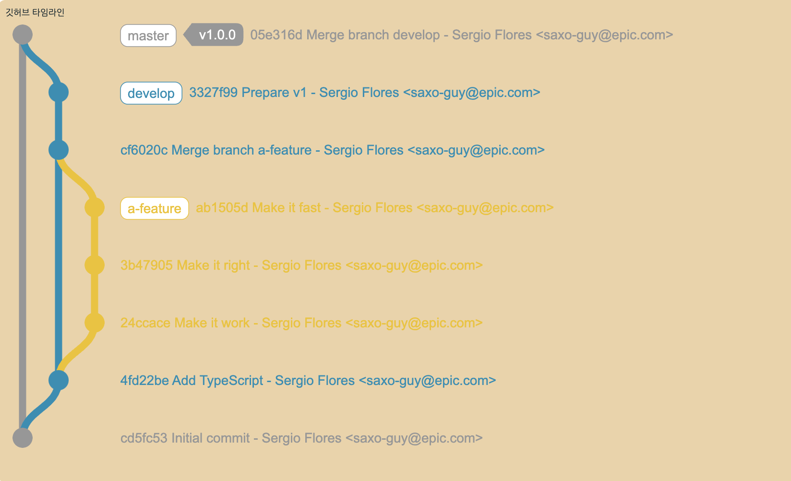

# liebespaar93.github.io

# 이미지 참조 
 [제딧/9Jedit](https://twitter.com/9Jedit)

# gitgraph
[gitgraph](https://www.nicoespeon.com/gitgraph.js/#15)
- 나중에 나의 깃에 commit 내역을 액션하여 출력하는 방식을 준비해야함
- api 가져오는법 
[공식 문서](https://docs.github.com/en/rest/commits/commits?)apiVersion=2022-11-28
https://api.github.com/repos/liebespaar93/liebespaar93.github.io/commits

# 공부할거 
[깃 에대하여](https://www.atlassian.com/ko/git/tutorials/learn-git-with-bitbucket-cloud)
[w3c](https://www.w3.org/TR/2008/WD-html5-20080610/dom.html#innerhtml0)
[esmodule에관하여](https://zubetcha.tistory.com/entry/Javascript-ES-Module)